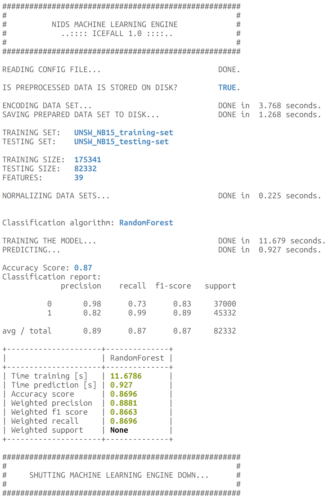
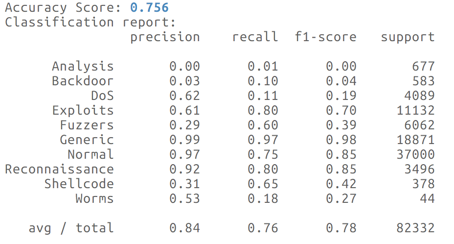
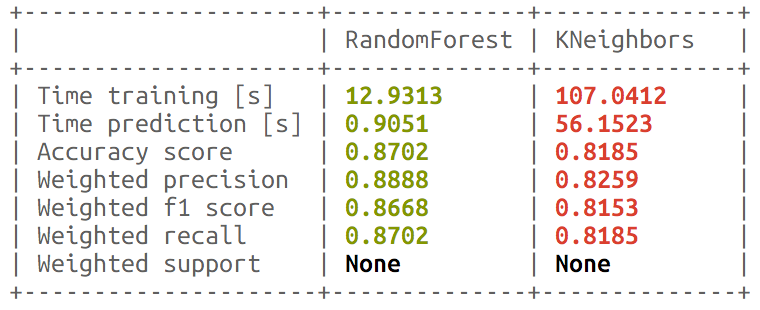
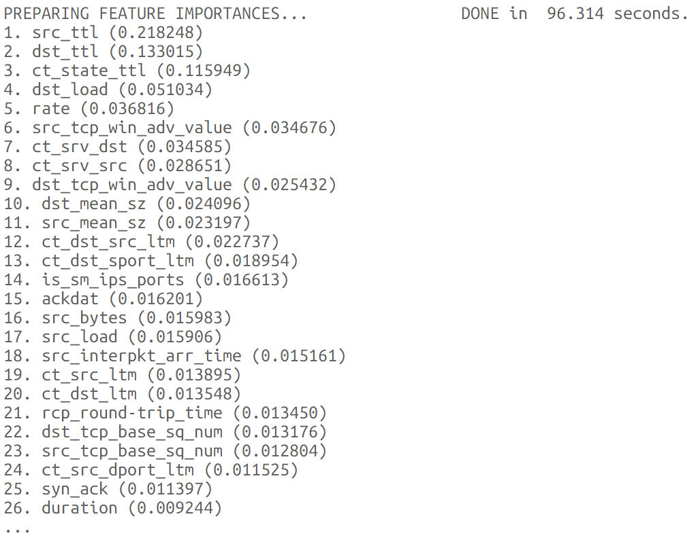
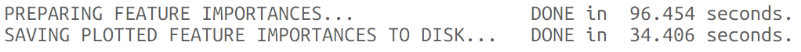
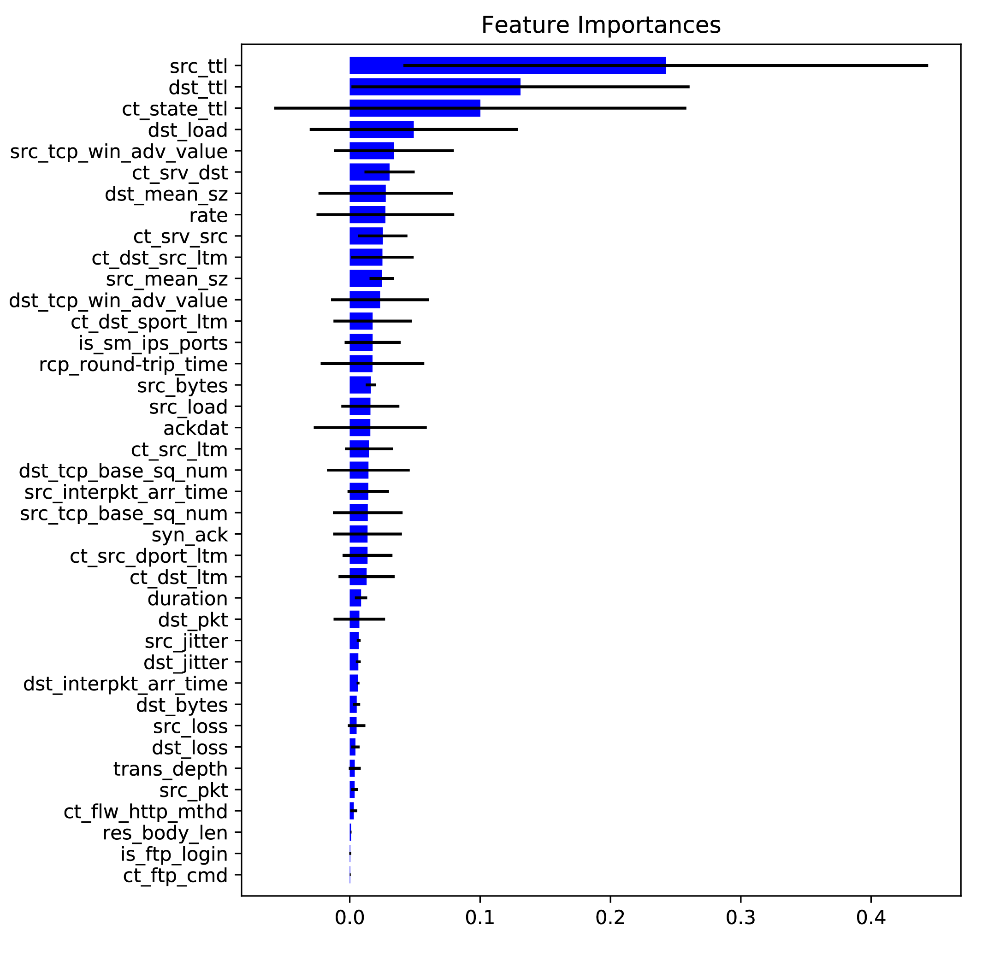

# NADICS
**NADICS** is an open source framework for the purpose of **Network Anomaly Detection for Industrial Control Systems** using classical machine learning and neural network methods. The software uses Scikit-learn and TensorFlow taking general datasets as input. This flexibility lets you easily do training and inference on a single CPU as well as multiple GPUs on a desktop or server without rewriting lots of code.

NADICS is modular, that is if any additional models are needed one can easily write their own module by having the knowledge in Python.

Any person having a basic knowledge in programming, machine learning and network securitycan use this framework. NADICS is general enough to applied for different network environments. However, the majority of effort is the pre-prossessing which requires fundamental knowledge in computer networks.

The software was originally developed by researchers and engineers working at the chair of IT Security at the Technical University of Munich for the purpose of conducting network intelligence research.

## Areas of application
As automated manufacturing systems become more and more complex, the need for new methodologies to improve the design and development of industrial monitoring and control solutions is becoming peremptory.

Coming along with the Digitalization the complexity of automated manufacturing systems is advancing as the need of modern Industrial Monitoring and Control Systems (ICS) is becoming peremptory. Therefore Programmable Logic Controllers (PLCs) are widely used in the automotive, energy, nuclear and health care industry.
Those critical Supervisory Control and Data Acquisition (SCADA) systems and PLCs are vulnerability against advanced attacks.

NADICS is able to detect those domain specific attacks based on the redicted information captured via Network TAP devices or sensors on industrial plants with a high accuracy.

## Limitations
To a certain extent the data sets need to be prepared before put into NADICS. This includes the labelling as well as the formatting.

The software does not contain a pretrained model. Thus the accuracy is highly dependent on the prepared dataset and chosen algorithmical model.

Further development goes to the post-processing part in terms of e.g. raising an alarm after having found a malicious activity. Due to different policies and network architectures handling the alarm should be implemented by the hosted developer.

## Installation using Anaconda

Ensure you have installed `conda` correctly. Execute `conda install nadics-1.0.0-py27_0.tar.bz2`. Visit [1] for more information.

## Installation using pip

Execute `python setup.py install`. Visit [2] for more information.

## Project structure

| **Folder**        | **Description**                                      |
| ------------- | ------------------------------------------------ |
| data          | Training and layout files should be stored here. |
| nadics       | Kernel code and configuration files.         |
| results       | Output folder for analyzed files. |

## Specifiying layout files
NADICS expects a layout file for each data set. For this purpose you can find `template.cfg` in `data/config`. E.g. the UNSW dataset in `data/example` requires the layout file `unsw.cfg` in `data/layouts`.

| **Attribute**          | **Description**     |
| ------------------ | --------------- |
| fullHeader     | All columns of the data set. |
| featureHeader  | Only the columns required for training. |
| binaryLabel    | One column containing the binary labels. |
| multiLabel    | One column containing the labels for multi classification. |
| stringFeatures | Only the columns containing strings in order to one-hot-encode. |

# The UNSW Dataset
The raw network packets of the UNSW-NB 15 data set was created by the IXIA PerfectStorm tool in the Cyber Range Lab of the Australian Centre for Cyber Security (ACCS) for generating a hybrid of real modern normal activities and synthetic contemporary attack behaviours. 
The number of records in the training set is 175,341 records and the testing set is 82,332 records from the different types, attack and normal. For information about the configuration data set and the method of the feature creation of the UNSW-NB15, please visit [3].


## Binary-classification with Random Forest

NADICS supports a variety of models do training and prediction single or multiple wise. Hereinafter we are showing how to execute the software with both methods and guide you through some of the outputs.

To start NADICS we choose binary-classification first entering `2` to classify between a *normal* and *malicious* attack. It follows one or more models to train and predict with as well as optional parameters. 

In order to enable you getting similar results we further parametrize our input with `-x 1.0 -y 1.0` to use the whole training and testing datasets. Adding `-w` will make sure any existing data that has been generated in a previous run will be overwritten.
```
python main.py 2 RandomForest -x 1.0 -y 1.0 -w
```


## Multi-classification with Random Forest

By using `-n` we are using multi-classification to distinguish between several attack scenarios.
```
python main.py n RandomForest -x 1.0 -y 1.0 -w
```


## Binary-classification with multiple models

Often we want to compare different models against each other using the same dataset. Therefore you can choose multiple different or
even the same models which are then run iteratevly. The end of the session will print a comparison of the chosen models with the best
and worst results highlighted.

Moreover you can use `-t` plus a number of seconds to determine when to cancel the execution with a single model, since e.g. the
Gaussian Process may take longer than expected to compute.
```
python main.py 2 RandomForest KNeighbors -x 1.0 -y 1.0 -w
```


## Analyzing feature importances

Datasets regarding network traffic are normally high dimensional. Hence we are interested in decreasing the number of dimensons to
reduce the computation time by still getting reliable results.

Therefore NADICS provides methods to output the importances of the features via console or to plot and write them to disk. 

By using `-i` we are printing all features with an importance greater or equal 1% onto the console.

```
python main.py 2 RandomForest -x 1.0 -y 1.0 -w -i
```


By using `-p` NADICS stores plots formatted as `.svg` into `results/plots` folder and outputs when it is done.
```
python main.py 2 RandomForest -x 1.0 -y 1.0 -w -p
```


As you can see the plot also visualizes the standard deviation of each feature.



## Help

You can get more information about how to run NADICS by just calling `python main.py -h`.

[1]: https://conda.io/docs/user-guide/install/index.html
[2]: https://pip.pypa.io/en/stable/installing/
[3]: https://www.unsw.adfa.edu.au/unsw-canberra-cyber/cybersecurity/ADFA-NB15-Datasets/
